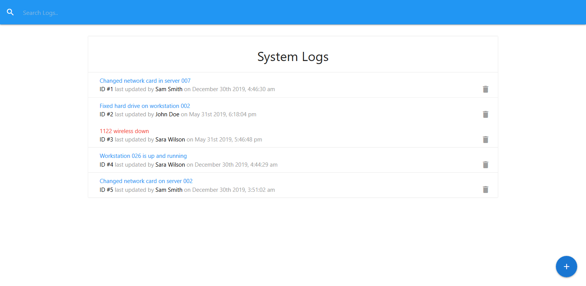
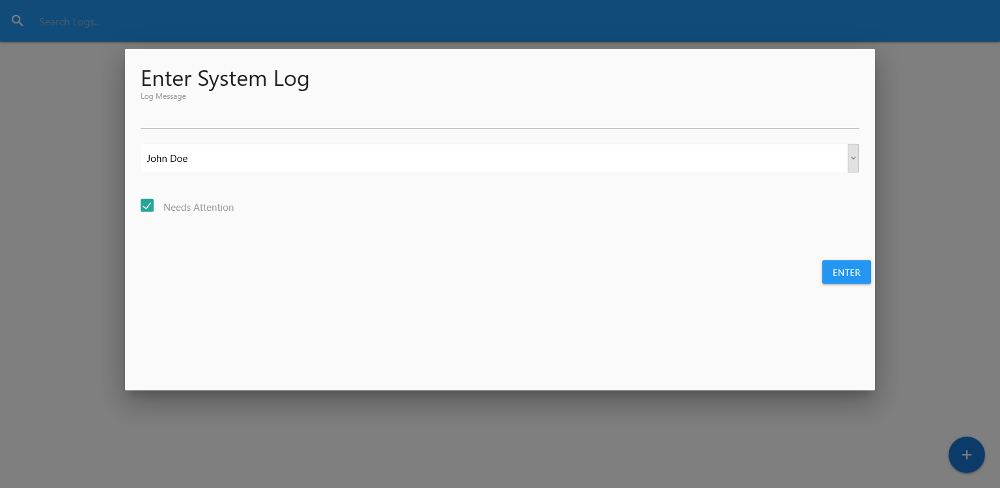
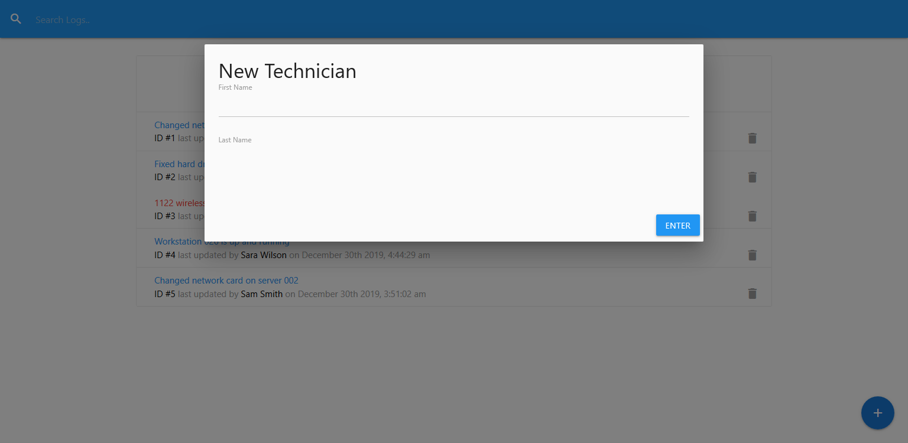
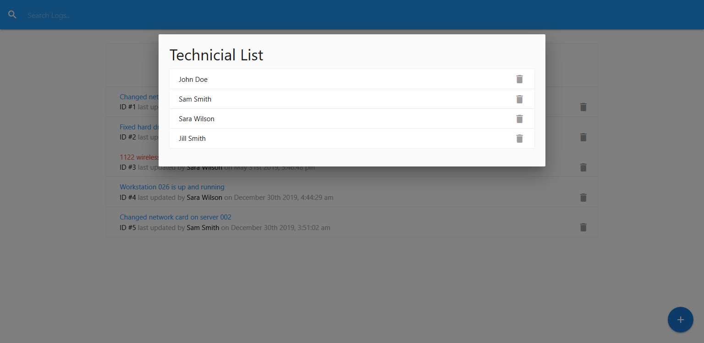

# Proyecto: IT Logger

El proyecto consiste en una app interna para el departamento de IT. Cuando alguien repara un disco duro, una workstation, un servidor, o similar, este es el lugar donde pueden agregar ese log.

1. **Entregables**  
Link del repositorio en GitHub, incluyendo un archivo README.md donde se detalle el árbol de componentes, así como una breve descripción de cada uno y las rutas (si se usaran).  
También debería incluir las instrucciones para poder clonar y ejecutar el proyecto.

2. **Requerimientos:** 
a. Cada log tendrá un ID, un message, el técnico que lo agregó, la posibilidad de marcarlo como "atention needed", así como la fecha y la hora. Ejemplo:

    ```json
    {
      "id": 1,
      "message": "Changed network card in server 007",
      "attention": false,
      "tech": "Sam Smith",
      "date": "2019-12-30T03:46:30.249Z"
    }
    ```

    b. En el dashboard principal se listarán los logs.

    c. Debe ser posible para el usuario agregar, editar y borrar los logs, así como agregar y borrar técnicos.

    d. También se debe permitir buscar en los logs.

    Cuando se haga una operación CRUD, salvo el listado de datos, el usuario debe poder ver un mensaje de que su acción se ha completado satisfactoriamente, o en su defecto, un mensaje de error.

    e. Para la API, usaremos json-server:

    https://github.com/typicode/json-server

    el cual nos permitirá obtener una fake API.

    Deberá usarse con el archivo provisto db.json el cual debería estar en el directorio raíz de nuestro proyecto.

    Podemos usar concurrently con scripts como estos en nuestro package.json:

    ```json
    "scripts": {
        "start": "react-scripts start",
        "json-server": "json-server --watch db.json --port 5000",
        "dev": "concurrently \"npm start\" \"npm run json-server\"",
        "build": "react-scripts build",
        "test": "react-scripts test",
        "eject": "react-scripts eject"
      }
    ```

    f. Para la interfaz de usuario, podemos usar la librería Materialize o similar, que nos facilite implementar los modals y el feedback al usuario:

    https://materializecss.com/

    g. Para el manejo de estado usaremos Redux.
    Debería haber como mínimo dos action creators y dos reducers, es decir para logs y para technicians respectivamente.

    h. Los componentes deberán tener su propio directorio/carpeta y estar dentro de src/components/

    Debería existir un solo componente por archivo.

    Evitar métodos render/return muy extensos.


3. **Criterios de evaluación**

    Se tendrá en cuenta:

    - Correcto funcionamiento de la aplicación (sin errores).
    - Cantidad óptima de componentes utilizados.
    - Correcta implementación de Redux.
    - Habilidad de abstracción y no duplicación de código.
    - Prolijidad e indentación/formateo del código.
    - El uso de librerías adicionales.

4. **Organización**

    Deberán elegir un grupo administrador de proyecto que será el encargado de la rama master y validará los pull requests.

    Luego habrá dos grupos más, y en cada fase deberán realizar las siguientes tareas:

    a. El grupo A definirá la estructura del proyecto, mientras el grupo B tomará nota de cuales podrían ser los componentes container y los de presentación.  
    El grupo admnistrador validará la estructura y los componentes.

    b. Trabajarán en diferentes ramas. El grupo A creará los componentes para los logs, mientras el B los de technicians. Mientras, el grupo administrador hará las pruebas y validará los pull requests.

    c. Una vez finalizadas las tareas, ambos grupos se reunirán con el grupo administrador para corregir posibles errores y detalles.

5. **Posibles Wireframes**







